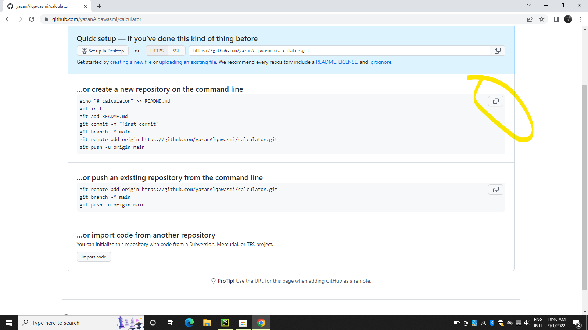
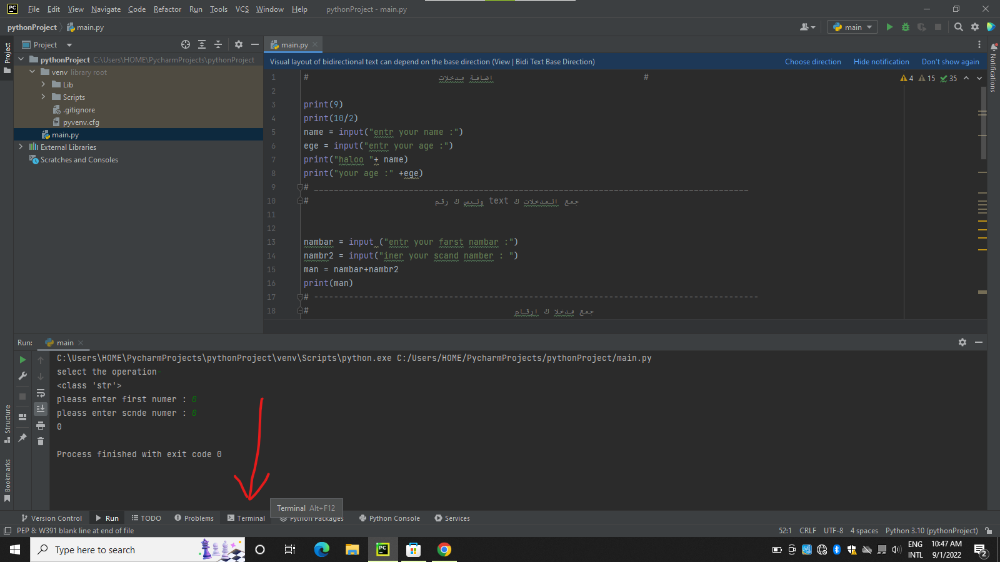

# How to Download Files on Github

- We press the new repository

- Then we copy this link

- Then we open the Terminal

- Then we choose Ubuntu

- Then we paste here

- Then we make a copy to download it 

- Then we put the command __git__  __add__ __.__

- Then we  the coputmmand __git__ __commit__

- Then we  the coputmmand __git__ __push__ __origin__ __caluc__

 